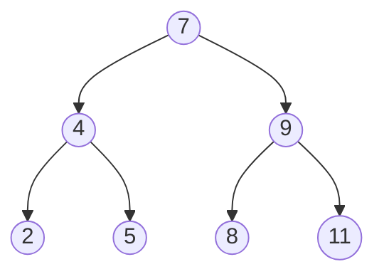

# 二叉搜索树（Binary Search Tree）

二叉搜索树对比之前的链表来说，搜索、删除、插入的效率大大提高

```mermaid
graph TD
    7((7))
    4((4))
    9((9))
    2((2))
    5((5))
    8((8))
    11((11))
    
    7 --> 4
    7 --> 9
    4 --> 2
    4 --> 5
    9 --> 8
    9 --> 11
```
如果是一颗满二叉树，时间复杂度为 O(h) = O(logn)

最坏情况：如果是按照从小到大的顺序去添加

```mermaid
graph TD
    7((7))
    4((4))
    9((9))
    2((2))
    5((5))
    8((8))
    11((11))
    
    2 --> 4
    4 --> 5
    5 --> 7
    7 --> 8
    8 --> 9
    9 --> 11
```
