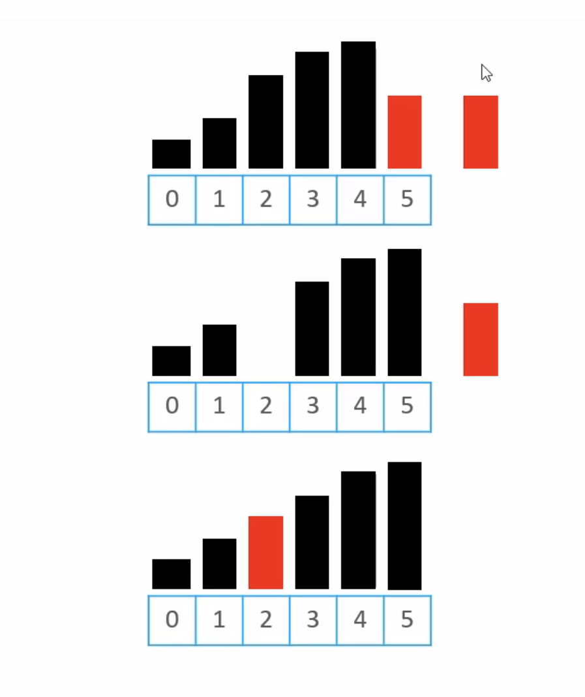

# 排序 Sorting

## 10大排序算法

| 名称                           | 时间复杂度                             | 额外空间复杂度 | In-place(原地算法) | 稳定性 |
| ------------------------------ | -------------------------------------- | -------------- | -------- | ------ |
|                                | 最好     最坏     平均                 |                |          |        |
| **冒泡排序（Bubble Sort）**    | O(n)    O(n²)    O(n²)                 | O(1)           | ✔        | ✔      |
| **选择排序（Selection Sort）** | O(n²)    O(n²)    O(n²)                | O(1)           | ✔        | ✖      |
| **插入排序（Insertion Sort）** | O(n)    O(n²)    O(n²)                 | O(1)           | ✔        | ✔      |
| **归并排序（Merge Sort）**     | O(nlogn)    O(nlogn)    O(nlogn)       | O(n)           | ✖        | ✔      |
| **快速排序（Quick Sort）**     | O(nlogn)    O(n²)    O(nlogn)          | O(logn)        | ✔        | ✖      |
| **希尔排序（Shell Sort）**     | O(n)    O(n^(4/3))~O(n²)               | O(1)           | ✔        | ✖      |
| **堆排序（Heap Sort）**        | O(nlogn)    O(nlogn)    O(nlogn)       | O(1)           | ✔        | ✖      |
| **基数排序（Radix Sort）**     | O(d*(n+k))    O(d*(n+k))    O(d*(n+k)) | O(n+k)         | ✖        | ✔      |
| **桶排序（Bucket Sort）**      | O(n+k)    O(n+k)    O(n+k)             | O(n+m)         | ✖        | ✔      |
| **计数排序（Counting Sort）**  | O(n+k)    O(n+k)    O(n+k)             | O(n+k)         | ✖        | ✔      |

冒泡、选择、插入、归并、快速、希尔、堆排序，属于比较排序（Comparison Sorting）

## 冒泡排序

执行流程（以升序为例）

```Swift
/// 冒泡排序
func bubbleSort(array: [Int]) -> [Int] {
    var array = array

    for end in (1..<array.count).reversed() {
        for begin in 1...end {
            if array[begin] < array[begin - 1] {
                let tmp = array[begin]
                array[begin] = array[begin - 1]
                array[begin - 1] = tmp
            }
        }
    }

    return array
}
```

## 冒泡排序的优化1
如果给出的序列已经完全有序，可以提前终止冒泡排序

```Swift
/// 冒泡排序优化1
func bubbleSort1(array: [Int]) -> [Int] {
    var array = array

    for end in (1..<array.count).reversed() {
        var sorted = true
        for begin in 1...end {
            if array[begin] < array[begin - 1] {
                let tmp = array[begin]
                array[begin] = array[begin - 1]
                array[begin - 1] = tmp
                sorted = false
            }
        }

        if sorted { break }
    }

    return array
}
```
## 冒泡排序的优化2

如果序列尾部已经局部有序，可以记录最后一次交换的位置，减少比较的次数

```Swift
func bubbleSort2(array: [Int]) -> [Int] {
    var array = array
    var end = array.count - 1 // 初始化终点位置为最后一个索引
    
    while end >= 1 {
        var sortedIndex = 0
        
        for begin in 1...end {
            if array[begin] < array[begin - 1] {
                array.swapAt(begin, begin - 1)
                sortedIndex = begin
            }
        }
        end = sortedIndex
    }
    
    return array
}

```

# 排序算法的稳定性（Stability）

如果相等的两个元素，在排序后的相对位置保持不变，那么这是稳定的排序算法

排序前 5，1，3a，4，7，3b
稳定排序 1，3a，3b，4，5，7
不稳定排序 1，3b，3a，4，5，7 

冒泡排序属于稳定排序算法

稍有不慎，稳定的排序算法也能被写成不稳定算法，比如说下面的冒泡算法就是不稳定的

```Swift
/// ☠️ 不稳定的冒泡排序
func bubbleSort(array: [Int]) -> [Int] {
    var array = array

    for end in (1..<array.count).reversed() {
        for begin in 1...end {
            if array[begin] <= array[begin - 1] {
                let tmp = array[begin]
                array[begin] = array[begin - 1]
                array[begin - 1] = tmp
            }
        }
    }

    return array
}
```

## 原地算法（In-place Algorithm）

何为原地算法？
- 不依赖额外的资源或者依赖少数的额外资源，仅依靠输出来覆盖输入

- 空间复杂度为O(1)的资源都可以认为是原地算法


## 选择排序

执行流程

① 从序列中找出最大的那个元素，然后与最末尾的元素位置交换

✓ 执行完一轮后，最末尾的那个元素就是最大的元素

② 忽略①中曾经找到的最大元素，重复执行步骤①

```Swift
/// 选择排序
func selelctionSort(array: inout [Int]) {
    for end in (1..<array.count).reversed() {
        var maxIndex = 0
        for begin in 1...end {
            if array[maxIndex] <= array[begin] {
                maxIndex = begin
            }
        }
        
        let tmp = array[maxIndex]
        array[maxIndex] = array[end]
        array[end] = tmp
    }
}
```

选择排序的交换次数远远小于冒泡排序，平均性能优于冒泡排序

最好、最坏的时间复杂度都是O(n^2), 空间复杂度O(1), 属于稳定排序

选择排序有没有优化的空间呢,答案是肯定的。可以优化到nlogn

# 堆排序HeapSort

堆排序可以认为是对选择排序的一种优化

执行流程
① 对序列进行原地建堆（heapify） 
② 重复执行以下操作，直到堆的元素数量为1
✓ 交换堆顶元素和尾元素
✓ 堆的元素数量减1
✓ 对0位置进行一次siftDown操作


# 插入排序（Insertion Sort）

非常类似扑克牌的排序

执行流程
①  在执行的过程中，插入排序会将序列分为两部分
✓ 头部是已经拍好序的，尾部是待排序的

② 从头开始扫描每一个元素
✓ 每当扫描到一个元素，就将它插入到头部合适的位置，使得头部数据依然保持有序

# 逆序对（Inversion）

什么是逆序对

数组[2,3,8,6,1] 的逆序对为[2,1], [3,1], [8,1], [8,6], [6,1] 共5个逆序对

插入排序的时间复杂度与逆序对的数量成正比关系
逆序对的数量越多，插入排序的时间复杂度越高

下面的这个数组的逆序对达到的顶峰

[9,8,7,6,5,4,3,2,1]

最坏、平均时间复杂度O(n^2)

最好的时间复杂度是O(n)

> 数组完全是升序

属于稳定排序

当逆序对的数量极少时，插入的排序效率特别高

速度甚至比O(nlogn)级别的快速排序还要快

数量不是特别大的时候，效率也是比较好的

# 插入排序 - 优化

思路是将【交换】转为【挪动】

① 先将待插入的元素备份
② 头部有序数据中比待插入元素大的，都朝尾部挪动1个位置
③ 将待插入的元素放到最终合适的位置



需要交换的次数越多，性能优化的越明显

# 二分搜索（Binary Search）

如何确定一个元素在数组中的位置（假设数组里面全都是整数）

▢ 如果是无需数组，从第0个位置开始遍历搜索，平均时间复杂度: O(n)
 
▢ 如果是有序数组，可以使用二分搜索，最坏的时间复杂度是 O(logn)


# 插入排序 - 二分搜索优化

在元素v的插入过程中，可以先二分搜索出合适的插入位置，然后再讲元素V插入

2，4，8，8，8，12，14

> 要求二分搜索返回的插入位置：第一个比V大的元素的前面

如果v是5 返回2
如果v是1 返回0
如果v是15 返回7
如果v是8 返回5

