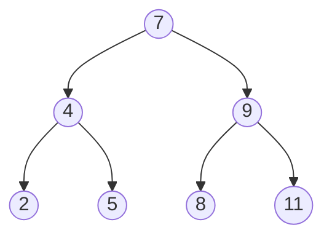
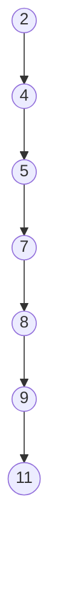

# algorithm-swift

## 1、线性表（List）

### 1.1 数组

#### 1.1.1 静态数组（Array）

初始化之前需要手动开辟内存，容量是固定的

#### 1.1.2 动态数组（Dynamic Array）

很多语言的数组是固定容量的，我们需要有一个能够动态扩容的数据结构，这个数据结构就是动态数组。使用的内存是连续的

### 1.2 链表（Linked List）

#### 1.2.1 链表（Linked List）

动态数组有一个明显的缺点，就是可能会造成内存空间的大量浪费，能否用到多少内存就使用多少内存？

链表就可以用到这一点，链表是一种链式存储的线性表，所有的内存地址不一定是连续的。

> **静态链表**： 前面提到的链表，是依赖于指针（引用）实现的，有些编程语言是没有指针的，比如早期的BASIC、FORTRAN语言。在没有指针的情况下，也是可以实现链表的。可以通过数组来模拟链表，称之为静态链表，数组的每个元素存放2个数据：值、下个元素的索引。

为了让代码更加精简，统一所有节点的处理逻辑，后来又出现了 `虚拟头节点链表`

#### 1.2.2 双向链表（Double Linked List）

使用双向链表可以提升链表的综合性能

#### 1.2.3 单向循环链表（Circle Linked List）

#### 1.2.4 双向循环链表（Circle Double Linked List）

### 1.3 栈（Stack）

栈是一种特殊的线性表，只能在一端进行操作，它的特点是`FILO`

### 1.4 队列（Queue）

#### 1.4.1 队列（Queue）

 队列是一种特殊的线性表，只能在头尾两端进行操作

 rear（队尾）：只能从队尾添加元素，一般叫做enQueue，入队

 front（队头）：只能从队头移除元素，一般叫做deQueue，出队

#### 1.4.2 双端队列（ Double Ended Queue）

双端队列是能在头尾两端添加、删除的队列

可以使用动态数组和链表来进行实现，因为队列主要是往头尾操作元素，我们选择双向链表

#### 1.4.3 环形队列（Circular Queue）

#### 1.4.4 环形双端队列（Circular Double Ended Queue）

## 2、树（Tree）

#### 2.1 二叉搜索树（Binary Search Tree）

简称BST，二叉搜索树对比之前的链表来说，搜索、删除、插入的效率大大提高。如果是一颗满二叉树，时间复杂度为 O(h) = O(logn)

最坏情况：如果是按照从小到大的顺序去添加，此时 O(h) = O(n)，二叉搜索树退化成链表

当n比较大时，两者性能差异比较大
比如当n = 1000000 时，二叉搜索树的最低高度是20

### 2.2 平衡二叉搜索树（Balanced Binary Search Tree）

AVL树是二叉搜索树的一种改进方案，避免了上述极端情况的产生，改进的方案是：在添加和删除之前，想办法让二叉树恢复平衡（减少树的高度）

> 平衡（balancing）：左右子树的高度约接近，就越平衡，相应的在搜索、删除、插入的操作中时间复杂度会减少。

如果继续调整节点的位置，完全可以达到理想的平衡，但是付出的代价可能会比较大。调整的次数比较多的时候，反而增加了时间复杂度。总的来说，比较合理

改进方案是，用尽量少的调整次数达到适度平衡即可。

一般也称他们为：自平衡的二叉搜索树（Self-Balancing Binary Search Tree）

#### 2.2.1 AVL树（AVL Tree）

AVL树是最早发明的自平衡二叉搜索树之一，名字取自两个发明者的名字G.M.Adelson-Velsky 和 E.M.Landis （苏联）

AVL树的特点

- 每个节点的平衡因子只可能是1， 0， -1（绝对值小于1）

- 每个节点的左右子树的高度差不超过1

- 搜索、添加、删除的时间复杂度是O(logn)

> 平衡因子（Balance Factor）：某个节点左右子树的高度差

AVL树是一种特殊的二叉搜索树，它在二叉搜索 `树添加` 或 `删除` 节点的时候对二叉树进行了再平衡（rebalance）操作
