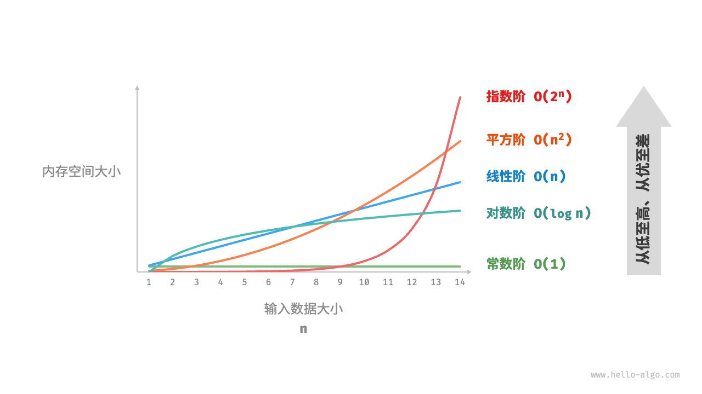

# 时间复杂度

## 从一个例子开始

题目：根据序号计算出斐波那契数列中对应的元素的值

> fibonacci 数列: 0 1 1 2 3 5 8 13 21 34 55 ...

直观的算法

```swift
// 递归的方法
func fib1(_ n :Int) -> Int {
    if (n <= 1) {
        return n
    }
    return fib1(n-1) + fib1(n-2)
}
```

优化后的算法

```swift
// 优化的算法
func fib2(_ n :Int) -> Int {
    if (n <= 1) {
        return n
    }

    var first: Int = 0
    var second: Int = 1
    
    for _ in 0...n-2 {
        let sum = first + second
        first = second
        second = sum
    }
    
    return second
}
```

测算函数执行的时间， 执行时间相差非常大

```swift
let clock = ContinuousClock()

let elapsed1 = clock.measure {
    print("ret: \(fib1(46))")
}

let elapsed2 = clock.measure {
    print("ret: \(fib2(46))")
}

let duration1 = elapsed1.description
print(duration1)

let duration2 = elapsed2.description
print(duration2)

```


## 如何评价一个算法的好坏

我们很自然的就会想到，比较不同算法对同一组的输入的执行处理时间来比较算法的好坏，这种方法也叫做**事后统计法**, 但是这种做法有比较明显的缺点

- 执行时间严重依赖硬件已经各种不确定的环境因素
- 编写相应的测算代码
- 测试数据的选择比较难保证公正性


 一般从以下为度来评估算法的优劣

- 般从代码的正确性、可读性、健壮性（对不合理输入的反应能力和处理能力）
- `时间复杂度`（time complexity）：估算程序指令执行次数
- `空间复杂度`（space complexity）：估算所需要占用的存储空间


## 一些计算程序执行次数的例子

程序的执行次数为`log2(n)`

```swift
func test(n: Int) {
    var n = n
    n = n / 2
    while (n  > 0) {
        n = n / 2
        print("test")
    }
}
```

程序的执行次数为`log2(n)`

```swift
func test(n: Int) {
    var n = n
    n = n / 2
    while (n  > 0) {
        n = n / 2
        print("test")
    }
}
```


## 大O表示法

一般使用O来描述复杂度，他表示的是数据规模n对应的复杂度

`忽略常数` 9 >> O(1)

`忽略系数` 2n + 3 >> O(n)

`忽略低阶` n<sup>2</sup> + 2n + 6 >> O(n<sup>2</sup>)

`对数阶一般省略底数 ` 

> $\log_2 n = \log_2 9 * \log_9 n$， 无论是 $\log_2 n$  还是 $\log_9 n$， 可以通过乘以一个常数来进行转换，所以 $\log_2 n$、$\log_9 n$ 统称为 `logn`

 

例题

计算这个函数的复杂度

```swift
func test(n: Int) {
    var i = 1
    // log2(n)
    while i < n {
        for _ in 0..<n {
            print("test")
        }
        i *= 2
    }
}
```

经过计算一个函数的执行次数是  $1+ 3* \log_2 n + n* \log_2 n$，那么这个函数的复杂度就是 `O(nlogn)`


> 大O表示法仅仅是一种粗略的分析模型，是一种估算，帮助我们短时间了解一个算法的执行效率


### 常见的复杂度

| 执行次数       | 复杂度   | 非正式术语 |
|----------------|----------|------------|
| 12             | O(1)     | 常数阶     |
| 2n+3           | O(n)     | 线性阶     |
| 4n²+2n+6       | O(n²)    | 平方阶     |
| 40g2n+25       | O(logn)  | 对数阶     |
| 3n+20g3n+15    | O(nlogn) | nlogn阶    |
| 4n³+3n²+22n+100| O(n³)    | 立方阶     |
| 2n             | O(2n)    | 指数阶     |

o(1) 、o(logn) 、o(n) 、o(nlogn) 、o(n<sup>2</sup>)  、o(n<sup>3</sup>) 、o(2<sup>n</sup>) 、o(n!) 、o(n<sup>n</sup>)



fib1的时间复杂度是O(n)

fib2的时间复杂度是O(2<sup>n</sup>)


### 算法的优化方向

1、用尽量少的存储空间

2、用尽量少的执行步骤


根据特殊的情况可以

- 空间换时间

- 时间换空间

### 多个数据规模的情况

O(n + K)

 ```
 public static void test(int n, int k) {
     for (int i = 0; i < n; i++) {
         System.out.println("test");
     }
     for (int i = 0; i < k; i++) {
     		System.out.println("test");
     }
 }
 ```


 更多复杂度的知识，后续补充...
