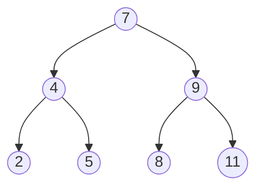
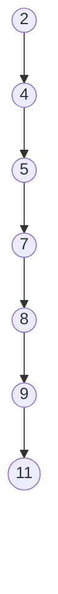

# AVL树

## 1、二叉搜索树复杂度分析

二叉搜索树对比之前的链表来说，搜索、删除、插入的效率大大提高

如果是一颗满二叉树，时间复杂度为 O(h) = O(logn)

最坏情况：如果是按照从小到大的顺序去添加，此时 O(h) = O(n)，二叉搜索树退化成链表

当n比较大时，两者性能差异比较大
比如当n = 1000000 时，二叉搜索树的最低高度是20

## 2、平衡二叉搜索树

### 平衡（balance）

左右子树的高度约接近，就越平衡

### 二叉搜索树的改进

添加和删除的顺序由外部输入，是无法限制的

改进的方案是：在添加和删除之前，想办法让二叉树恢复平衡（减少树的高度）

如果接续调整节点的位置，完全可以达到理想的平衡，但是付出的代价可能会比较大。调整的次数比较多的时候，反而增加了时间复杂度。总的来说，比较合理的改进方案是，用尽量少的调整次数达到适度平衡即可。

一颗达到适度平衡的二叉搜索树，可以称之为：平衡二叉搜索树

## 平衡二叉搜索树（Balanced Binary Search Tree）

简称 **BBST**，经典常见的平衡二叉搜索树有

`AVL树` 

windows NT内核汇总广泛使用

`红黑树`

C++ STL

Java的ThreadMap、TreeSet、HashMap、HashSet

linux进程调度

Ngix的timer管理

一般也称他们为：自平衡的二叉搜索树（Self-Balancing Binary Search Tree）

## 3、AVL树的基本概念

AVL树是最早发明的自平衡二叉搜索树之一

名字取自两个发明者的名字G.M.Adelson-Velsky 和 E.M.Landis （苏联）

`平衡因子`（Balance Factor）：某个节点左右子树的高度差

AVL树的特点

- 每个节点的平衡因子只可能是1， 0， -1（绝对值小于1）

- 每个节点的左右子树的高度差不超过1
- 搜索、添加、删除的时间复杂度是O(logn)

平衡对比

## 因为添加的操作导致的失衡

- 最坏的情况：会导致所有的祖先节点失衡

- 父节点、非祖先节点，都不可能失衡

## LL - 右旋转（单旋）

## RR - 左旋转（单旋）

## LR - RR左旋转、LL右旋转

## 练习题

根据输入推演AVL树的最后的形状

输入数据  13, 14, 15, 12, 11,17, 16, 8, 9, 1
