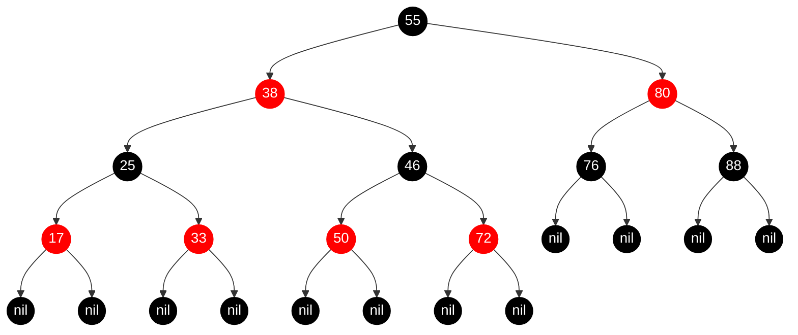
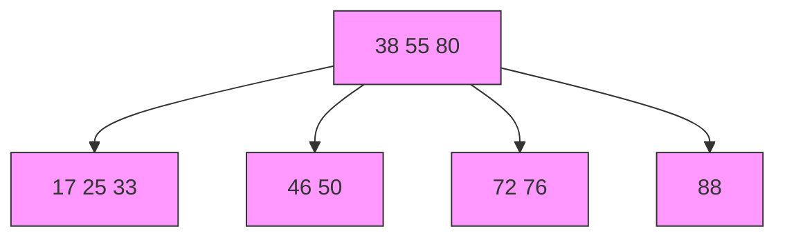

# 红黑树

红黑树也是一种自平衡二叉树，以前也叫做平衡二叉B树（Symmetric Binary B-tree）

1、节点是RED或者Black

2、根结点事Black

3、叶子节点（外部节点，空节点）都是black

4、红节点的子节点都是黑色

> 推论1：Red节点的parent都是Black
>
> 推论2：从根节点到叶子节点的所有路径上不能有两个连续的red节点

5、从任一节点到叶子节点的所有路径都包含相同数目的Black节点

练习1: 准确的判断一棵树是不是红黑树

## 红黑树的等价变换

红黑树等价变化之后，其实就是一颗B树

- 红黑树 和4阶B树（2-3-4树）具有等价性

- BLACK节点与它的RED子节点融合在一起，形成一个B树节点

- 红黑树的black节点个数与4阶B树的节点总个数相等

> parent: 父节点
>
> sibling: 兄弟节点
>
> uncle: 叔父节点（parent的兄弟节点）
>
> grand: 祖父节点（parent的父节点）

