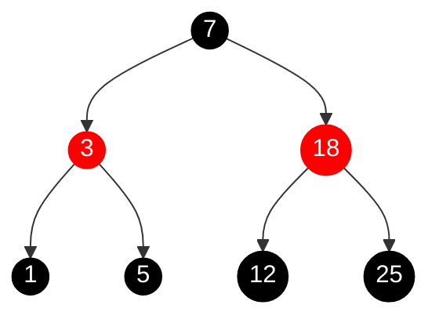

# 红黑树示例

下面是一个红黑树的Mermaid图表示例：

这个红黑树示例满足以下红黑树的性质：

1. 节点是红色或黑色
2. 根节点是黑色
3. 所有叶子节点（外部节点）都是黑色
4. 红色节点的子节点都是黑色
5. 从任一节点到叶子节点的所有路径都包含相同数目的黑色节点

在这个示例中：
- 黑色节点用黑色圆圈表示
- 红色节点用红色圆圈表示
- 数字代表节点的值
- 箭头表示节点之间的关系

这个树是一个合法的红黑树，因为它满足所有红黑树的性质要求。 